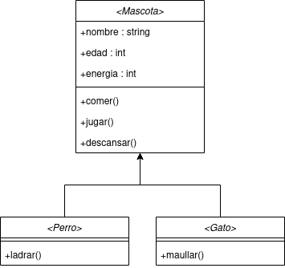

# Mascota Virtual PHP

En este proyecto trataremos de crear a través del lenguaje PHP, una mascota virtual con la que podamos interactuar.
Para ello, deberemos de desarrollar las clases necesarias para cada caso y sus respectivos métodos que ayudarán a interactuar con nosotros.

Aclarar que este proyecto se va a dividir en dos fases : una primera en la cual se va a desarrollar toda la lógica de la mascota virtual sin muchas complicaciones y en terminal, mientras que en la segunda fase lo intentaremos llevar mas allá con una interfaz gráfica, una sesión de juego que guardará el estado de la mascota para cuando volvamos a entrar en ella y además de una interfaz algo más gráfica y amigable.

1. Fase : 
    - Diagrama de clases
    - Creación de las clases
    - Desarrollo de los métodos
    - Implementación de los métodos
    - Terminal
2. Fase : 
    - Sesión de juego
    - Algún nuevo método
    - Interfaz gráfica

## Diagrama de clases

## Requisitos

* PHP 7.4.x o superior

## Instalación

1. Clonar el repositorio
2. Lanzar con php el archivo mascota.php
3. Si todo va bien, se mostrará un menú interactivo con las opciones que se indican en el archivo mascota.php
4. Y ya podremos crear e interactuar con nuestra mascota virtual

## Autor

[Pablo Casal - @pablocsl](https://github.com/pablocsl)